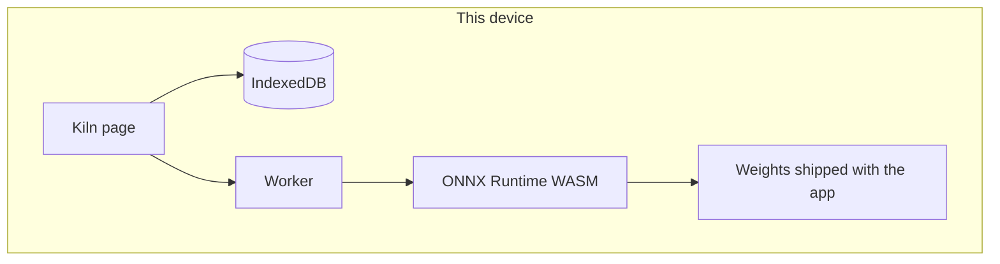

# Kiln architecture

Kiln is a local-first chat page. One person, one browser profile, a small model that runs in the tab. The page is a responsive web app (Vite, static files, `base: './'`), so the same build is the desktop view and the phone view. A native shell is out of scope.

## Where the model runs

Inference runs in the browser tab, on this device.

A dedicated web worker loads [LaMini-Flan-T5-77M](https://huggingface.co/MBZUAI/LaMini-Flan-T5-77M) (Apache-2.0) through Transformers.js and ONNX Runtime Web. The weights are the int8 ONNX files shipped in `public/models/`. The runtime is the single-thread `asyncify` WebAssembly build in `public/ort/`, copied from `onnxruntime-web` when you start or build the app. The worker forces `device: 'wasm'` and `dtype: 'q8'`.

The UI thread never sends the prompt to a server. It posts the prompt to the worker. The worker returns text. Decoding happens in the tab.

This is the on-device path for the prototype: real weights, local runtime, CPU via WebAssembly. A later phone build would keep this boundary and swap in a larger instruct model on WebGPU, or a native runtime (llama.cpp, MLX, or the platform ML stack) inside a web view. That packaging is not in this slice. See `NOTES.md`.

## What is stored, and where

| Data | Where | Leaves the device? |
| --- | --- | --- |
| Threads and messages | IndexedDB database `kiln`, store `threads`, in this browser profile | No |
| The reply in progress | Memory in the page, until it is finished and written to IndexedDB | No |
| Model weights and WASM | Static files of the app. The browser may keep its ordinary HTTP cache of those files | The files are the app itself. The transcript is not among them |
| Theme | Follows the system color scheme. Nothing is written for it | No |

Reloading the page reads IndexedDB and shows the same threads before the model finishes loading again. Closing the dev server does not delete that database. Starting the server and opening the page shows the history again.

There is no account, no server database, and no sync store.

## What never leaves the device

- The message text, thread titles, and the fact of the conversation
- The prompt assembled for the model
- Activations and generated tokens
- The IndexedDB database

The running app is not allowed to call a hosted chat API. `env.allowRemoteModels` is false, `local_files_only` is true, and the dev and preview servers send `Content-Security-Policy: connect-src 'self'`. A request to Hugging Face, a model CDN, or a chat vendor is blocked by that policy and would also fail the local-files setting.

## What network calls the running app makes

None for inference.

The page loads its own files from the same origin that served it: HTML, JS, CSS, fonts, the WebAssembly runtime, and the ONNX weights. With `npm run dev` or `npm run preview`, that origin is the local Vite process on this machine. If you later host the static `dist/` folder, the browser downloads those app files from that host once. It still does not post the transcript back.

There is no analytics call, no telemetry, and no font or script CDN at runtime. Fonts are bundled. `Referrer-Policy` is `no-referrer`.

`npm install` talks to the npm registry. That is the install step, not the running app. `scripts/fetch-model.mjs` can re-download the weights from Hugging Face if those files are missing. The page never runs that script.

## How one turn works

1. The page opens IndexedDB and paints any saved threads.
2. The worker loads `config.json`, the tokenizer, `encoder_model_quantized.onnx`, and `decoder_model_merged_quantized.onnx` from the same origin, then starts the WASM session.
3. The person sends a message. The page writes the user turn to IndexedDB immediately.
4. The worker runs a short text-to-text generation (greedy, at most 48 new tokens) and streams pieces back.
5. The page writes the assistant turn to the same thread and IndexedDB.

The model context is 512 tokens. The page keeps the latest turns, trimmed to about 1,200 characters, so the newest message stays inside that window.

## Left out on purpose

Accounts, login, cloud sync, plugins, tools, voice, image generation, attachments, a model catalog, sharing, multi-user rooms, and an installable native shell. There is one page, not a set of product routes. Export and encryption beyond the browser profile are also out. The full list and the reason for the small model are in `NOTES.md`.

## Layout of the code

```text
index.html          page shell
src/main.ts         transcript, composer, thread list
src/db.ts           IndexedDB
src/prompt.ts       local prompt and reply cleanup
src/worker.ts       transformers.js session, remote models off
src/styles.css      layout for a wide window and a phone
public/models/      vendored ONNX weights and tokenizer
public/ort/         WASM runtime, copied at dev/build/preview
```



Nothing in that diagram sends the transcript off the device.
